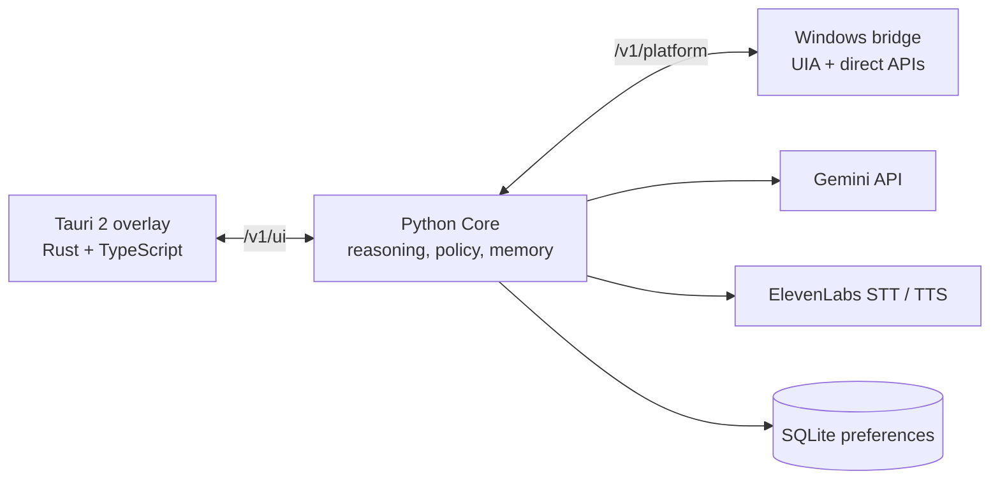

# THURSDAY

**T**echnologically **H**elpful **U**niversal **R**easoning **S**ystem for **D**igital **A**ccessibility and **Y**ou

Thursday is an accessibility-first agent that operates a Windows computer on your behalf. Press a shortcut, say what you want in your own words, and it works out which controls on screen mean that — then uses them, narrating and asking before anything it can't take back.

Built at VTHAX 14 (36 hours). Gemini for reasoning, ElevenLabs for voice, Windows UI Automation for eyes and hands.

```
"show me the stuff I bought recently"  ->  invokes the control labeled "Returns & Orders"
"make everything bigger"               ->  display scaling, via direct API, no settings maze
"why can't I hear anything"            ->  reads endpoint state, finds the muted app, unmutes it
```

---

## Why it exists

Using a computer still means speaking the computer's language: which menu hides the option, what an unlabeled icon does, which of six buttons is the real one. That's friction for everyone. For someone with a visual, motor, or cognitive impairment — or someone who just never got comfortable with computers — it's a wall.

Screen readers read the screen. Thursday *understands* it, and can act on it.

## What makes it different from "an AI that clicks things"

Most computer-use agents screenshot the screen and ask a vision model where to click. That's slow, expensive, unreliable at small text, and it sends a picture of everything you're doing to the cloud on every step.

Thursday treats the accessibility tree as the source of truth. Windows already publishes what every control *is* — its role, name, description, bounds, whether it's enabled, whether it's a password field. Thursday reads that, indexes it semantically, and acts through the same accessibility interfaces a screen reader uses.

Vision is a **fallback, not a default**, and it's gated: the agent must search the semantic index, then request broader UI state, then a specific region, before it may ever request a full screenshot. Each tier is enforced in code (`escalation_order`), not suggested in a prompt.

```
       cheap, private, precise                        expensive, invasive
    ---------------------------------------------------------------------->
    search_ui -> get_ui_state -> inspect_region -> inspect_screen
    (local vectors)  (UIA tree)   (cropped image)   (full screenshot)
```

## Architecture

Three processes, developed independently, speaking one versioned JSON protocol over loopback WebSockets.



| Component | Owns | Stack |
|---|---|---|
| `apps/ui/` | Overlay, tray, global shortcut, mic capture, speech playback, pointer animation, confirmation UI | Tauri 2, Rust, TypeScript |
| `core/agent/` | Model loop, tool orchestration, policy, confirmations, three-tier memory, semantic retrieval, voice | Python 3.11+ |
| `platform/windows/` | UIA observation, element relocation, direct system APIs, guarded launches, capture | Python + `uiautomation`, `pycaw`, `WMI`, `mss` |
| `shared/` | Protocol schema (Draft 2020-12) + tool catalog — one file feeds both the wire validator and Gemini's function declarations | JSON |
| `mocks/` | Fake desktop, fake UI, full socket stack — runs with no Windows, no Rust, no API key | Python |

**No OS-specific code lives in Core.** A macOS adapter implementing the same `ToolCall`/`ToolResult` protocol would light up every existing capability; `platform/macos/` is the placeholder.

### The semantic world model

Every UI element the bridge reports becomes a structured object (role, name, description, bounds, enabled, visible, parent/child, source, sensitive, action_kind). Core keeps an ephemeral vector index over the text of those elements, keyed by stable element ID.

That's what lets "the stuff I bought recently" resolve to a control literally labeled **Returns & Orders**. Natural language doesn't have to match the pixels.

The index is deliberately honest about what it is: deterministic feature hashing (256-dim) plus a small explicit synonym map. It works offline, downloads nothing, and `embed()` is a one-function swap for a real embedding model. Geometry-only changes reuse existing vectors; elements marked sensitive are never indexed at all.

### Three memories, kept separate

| Memory | Scope | Lifetime |
|---|---|---|
| **Working** | Recent conversation, 24-item cap | In-process, TTL on inactivity, cleared on sleep/resume |
| **Long-term** | Accessibility preferences + explicit `Remember task:` / `Remember context:` notes | Local SQLite, `0600`, deletable by removing one file |
| **World** | Live structured desktop + semantic index | Ephemeral, rebuilt per task |

Long-term memory is opt-in by pattern match, not by model judgment. Anything that looks like a secret is rejected before it's written. Full history is never dumped into a prompt — only the top-k retrieved entries.

## Safety: the model proposes, Python decides

The model never authorizes its own actions. Every proposed tool call crosses an independent policy layer that classifies risk from *trusted adapter metadata*, not from anything the model or the on-screen text says.

- **The model's own risk labels are ignored.** It cannot talk its way down a tier.
- `action_kind=navigation` comes only from trusted UIA structural semantics — never from a button's display name, which any app or webpage controls.
- Destructive, security-sensitive, and unknown-target actions require explicit human confirmation.
- Confirmations are **single-use, expiring, and hash-bound** to the exact `ToolCall` and the world revision they were approved against. If the desktop changes while you're deciding, consent is invalidated and the agent has to ask again.
- A denial stops the task. It does not trigger a search for another route to the same outcome.
- Arbitrary shell is **review-only** — `propose_command` returns the command as text and never executes it.
- A locked workstation is never operated.
- One tool per model turn, max 16 turns, hard timeouts, no automatic retries of mutating actions.

Two postures via `AGENT_POLICY_MODE`: `assistive` (default — operating a named, visible, enabled control is the job, not an escalation) and `strict` (fail-closed, confirms every non-provably-reversible mutation). This matters for accessibility specifically: a tool that prompts constantly is a tool whose prompts stop being read.

Bridge-side, the ordering is deliberate and re-verified: refuse core-owned tools → validate against shared schema → refuse if locked → **re-locate the target in the live tree** → check `expected_revision` immediately before execution → execute exactly one operation → re-snapshot and return an authoritative delta. UIA trees get rebuilt between calls; a cached COM reference is not evidence the target is still what Core approved.

## Voice

Push-to-talk on `Ctrl+Alt+J`. The overlay records one utterance, ends on trailing silence, and ships it to Core, which transcribes with **ElevenLabs Scribe**. Replies, questions and confirmations come back as **ElevenLabs multilingual TTS** and play through the overlay.

The important part isn't that it talks — it's *what* it says. The system prompt forbids tool names, element IDs, coordinates, risk labels and revision numbers in anything read aloud. Confirmations are spoken in the words a person actually uses:

> "Hey, I want to use Delete, but that one deletes it for good, and I don't think I can undo it. Is that okay?"

Answers are resolved **deterministically in Python**, never by the model: an explicit yes/no vocabulary decides consent, silence and gibberish count as no, and a *question* ("what do you mean?") counts as neither — so the agent re-explains in plainer words, extends the timer, and asks again instead of treating confusion as refusal.

The whole loop is usable without ever looking at the screen. Typed input remains a full fallback; no voice key is needed to use Thursday.

## The overlay

A transparent, click-through, always-on-top Tauri window that lives in the tray. It has no chrome and steals no focus. It shows:

- a **summon ring** that expands from your cursor when Thursday wakes, lighting the screen edges where it reaches them, and collapses back on dismiss
- a **live level meter** driven by microphone loudness while you speak
- a **pointer comet** that animates toward a target *before* the bridge acts on it, so you can see where the machine is about to go and why

All of it honors `prefers-reduced-motion`. `invoke_ui` runs in `visible` mode by default — the pointer visibly travels to the control, the bridge re-resolves the same semantic target, *then* activates it. The animation and the real action describe the same event.

---

## Quick start — no API keys, no Windows, no Rust

Python 3.11+, from the repository root:

```sh
python3 -m venv .venv
source .venv/bin/activate          # Windows: py -3 -m venv .venv; .venv\Scripts\Activate.ps1
python -m pip install -e '.[dev]'
python run.py demo --mode mock     # Core against an in-process fake desktop
python run.py stack                # real WebSockets: Core + mock bridge + mock UI
pytest -q
```

Both demos run the "stuff I bought recently" → **Returns & Orders** retrieval and invocation. Mock output is labeled as mock; no OS action and no cloud call occurs. Non-interactive harnesses deny confirmations by default.

### Three separate processes

Generate two distinct tokens (`python -c "import secrets; print(secrets.token_urlsafe(32))"`, twice). Core holds both; each client gets only its own.

```sh
export AGENT_UI_TOKEN='<token-one>'
export AGENT_PLATFORM_TOKEN='<token-two>'
python run.py serve --mode mock
# terminal 2
python run.py mock-platform
# terminal 3
python run.py mock-ui 'show me the stuff I bought recently' --interactive
```

Core listens on `ws://127.0.0.1:8765/v1/ui` and `/v1/platform`.

### Live, on Windows

```sh
pip install -e '.[windows]'
export GEMINI_API_KEY=...          # Core process only; never crosses IPC
export ELEVENLABS_API_KEY=...      # optional: voice
export ELEVENLABS_VOICE_ID=...     # optional: speech output
python run.py serve --mode gemini
python run.py windows-platform
```

Then `npm install && npm run tauri dev` in `apps/ui/`, or use the tray app's settings panel, which can start and stop Core and the bridge for you. Default model `gemini-3.8-flash` (override with `GEMINI_MODEL`); STT `scribe_v2`, TTS `eleven_multilingual_v2`.

Core reads the process environment. `.env.example` is a template and is **not** auto-loaded. See [provider setup](docs/providers.md).

## Layout

| Path | Contents |
|---|---|
| `core/agent/` | `engine` loop · `policy` authorization · `world` state+search · `memory` · `providers` · `transport`/`server` |
| `shared/` | `protocol.schema.json`, `tools.json`, `examples.json` |
| `apps/ui/` | Tauri shell (`src-tauri/src/lib.rs`), overlay, voice, pointer, settings |
| `platform/windows/` | `bridge.py` + `winbridge/` (uia, executor, guards, classify, system_api, capture, rawinput, session) |
| `platform/macos/` | Future adapter placeholder |
| `mocks/`, `tests/`, `docs/` | Fakes, 51 offline tests, architecture and contract docs |

Start with [architecture](docs/architecture.md) and [wire contracts](docs/contracts.md).

## Honest boundaries

Written down because a demo that hides its edges isn't a demo you can trust.

- The local embedder is feature hashing with a synonym map, not a pretrained embedding model. It's a baseline, and it's swappable.
- Arbitrary shell execution is disabled in this build, not sandboxed.
- Local token auth protects against untrusted local clients. It does not isolate against malware running as the same OS user.
- Desktop state can race between processes. The bridge re-validates at dispatch, but an action already sent cannot be recalled — cancellation says so plainly rather than claiming a rollback.
- macOS is architecture, not implementation.
- Cloud retention follows your provider account's terms. This prototype cannot promise otherwise.

## Built with

Python · Rust · Tauri 2 · TypeScript · WebSockets · JSON Schema · Gemini API (`google-genai`) · ElevenLabs Scribe + TTS · Windows UI Automation · WASAPI/pycaw · WMI
