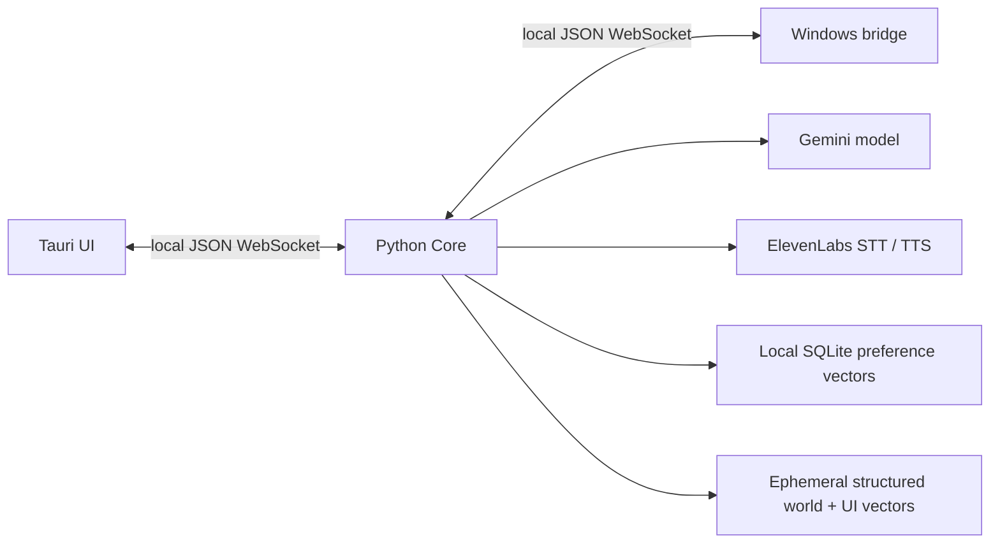

# Architecture and scope

The complete runnable vertical slice is Python Core + fake desktop + terminal UI.
Tauri and Windows are intentionally teammate scaffolds. Real OS control is not
implemented. Mock mode is conspicuously labeled and never billed as Gemini output.
Every real typed/transcribed request enters Gemini before any tool. No fast intent
router exists; `model_factory` is the extension seam for future routing experiments.

Core owns task lifecycle, model history/tool continuation, context selection,
policy, exact-action confirmations, memory, platform orchestration and voice.
`shared/` owns contracts. UI owns presentation, capture and playback. Platform owns
OS observation/action and trusted UI metadata. No OS-specific code lives in Core.

One UI, one bridge, one active task per Core instance protects a single shared
computer. The loop is capped at 16 model turns, each provider/adapter operation is
bounded by a timeout. It executes at most one proposed tool per model response,
returns replan_required for extras, and refreshes UI after mutations. Actions are
never auto-retried. Cancellation interrupts waiting model, voice, confirmation and
adapter operations and sends a best-effort bridge cancel. It cannot undo an action
already dispatched. UI disconnect cancels the active task; bridge disconnect fails
pending calls. Exact model response parts preserve Gemini thought signatures.

## Three memories

- Working: in-process recent conversation, 24-item cap, configurable inactivity TTL
  (AGENT_WORKING_TTL, seconds). Restart clears it; sleep_epoch changes clear it.
  Current task observations/actions and world state are bounded separately.
- Long term: local SQLite preference text + 256-dimensional vectors. Promotion is
  considered on every user input, but only explicit allowlisted accessibility
  preferences are retained. Secret-looking strings are rejected. Relevant entries
  are retrieved by cosine similarity; full history is never loaded into prompts.
  Delete `.agent-data/memory.sqlite3` while Core is stopped to forget everything.
- System semantic index: ephemeral vectors keyed by stable element ID. Structured
  UIElement state remains authoritative. Deltas and full snapshots add/update/remove
  entries; geometry-only updates reuse embeddings. Sensitive elements are excluded.

The lightweight embedder uses deterministic feature hashing plus an explicit small
synonym dictionary (e.g. bought/orders/returns -> purchase). It works offline with
no model downloads or service. It is an intentionally limited semantic baseline,
not a pretrained language embedding model. Replace `embed()` to improve recall;
rebuild vectors and version the index if dimensions/tokenization change.

## Context and vision

Initial input contains recent conversation, relevant preferences, and any current
world context (a new task begins with unknown desktop state). Gemini can ask for
system state, then `search_ui` (Core fetches a UI snapshot locally when needed),
then broader UI state, region image and finally full screenshot. Core enforces
search + broader UI inspection before a region and a region before a full screen.
Only explicit approved image calls capture and upload. Real image bytes are passed
as Gemini inline multimodal parts. Metadata reports fields/IDs/counts/image byte
sizes being sent, not raw context or credentials. Model history retains images
within that bounded task; they are not persisted in conversation memory.

## Policy and security boundaries

Model proposes; Python code classifies. READ_ONLY and known REVERSIBLE actions
usually pass. CONSEQUENTIAL, DESTRUCTIVE and SECURITY_SENSITIVE operations require
confirmation. invoke_ui consults fresh trusted action_kind: only known navigation
is reversible, delete is destructive, secure fields are security-sensitive.
Unknown coordinate clicks, keypresses and typing always ask. Model labels cannot
lower risk. Only bounded volume/brightness operations are allowlisted. Arbitrary
shell is review-only even after confirmation. A model request_confirmation grants
no authority to a later action.

Confirmation is session-owned, expires, binds task/call/hash and is single-use.
Denied/cancelled approval never dispatches that call. Targets are refreshed after
human delay and changed revision invalidates consent. The real bridge must also
verify target/revision at dispatch: desktop state can race between processes.

Loopback bind, distinct >=32-character random role tokens, five-second auth timeout,
strict paths/origins and JSON schemas, size limits, one connection per role and
single active task are practical local protections. This does not isolate against
malware running as the same OS user. Tokens must be distributed via a trusted
launcher/private files. No API keys cross IPC. Provider exceptions are sanitized.
UI descriptions and memory are untrusted data in the model instructions.

Denial/expiry stops the task entirely, so the model cannot retry a denied action
through another tool. Mutating-call exceptions and failed post-action observations
end with execution_uncertain. UI mutation ToolCalls carry expected_revision, bound
into the confirmation hash; the bridge must enforce it at dispatch. Unknown app
names require consent; the reversible app list is calculator/notepad/settings/browser
and the adapter must resolve those names safely. Unsolicited image results from
non-capture tools are rejected before provider input.
